# Neural Style Transfer

Implementations of various neural style transfer algorithms. Generate a new image by transfering the content of one image and the style of another.

## A Neural Algorithm of Artistic Style

Original paper by [Gatys et al. \[2015\]](https://arxiv.org/abs/1508.06576).

Works by using a pretrained image classification model and comparing output features between the generated image and the content image.
The style features are generated by computing the Gram matrix of the output features from the style image.
The Gram matrix gives an indication of what features are correlated to eachother to make a style.
Compute a loss function from the L2 differences of the content and style features and solve the optimization problem by treating the generated image as the optimization variable.

The algorithm is implemented in PyTorch using a VGG19 model pretrained on the 1000 class ImageNet. The optimization is implemented with PyTorch autograd and the L-BFGS numerical algorithm.

Also includes a total variation loss component to minimize high-frequency noise in the generated image.

### Examples

 <table>
  <tr>
   <th>Content</th>
   <th>Style</th>
   <th>Output</th>
  </tr>
  <tr>
   <td>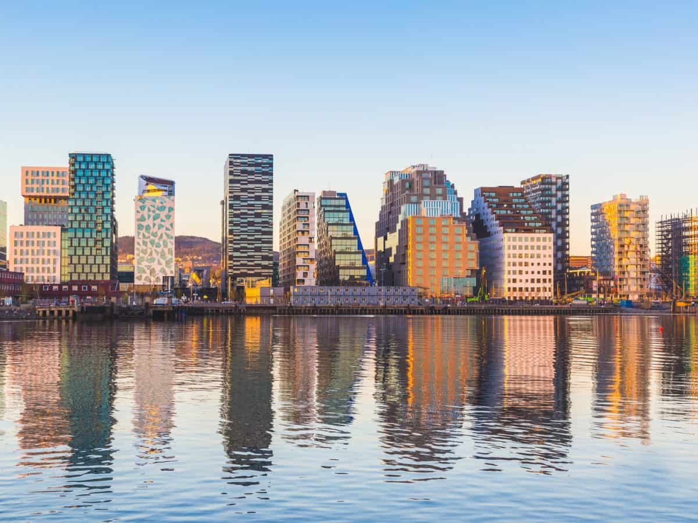</td>
   <td></td>
   <td>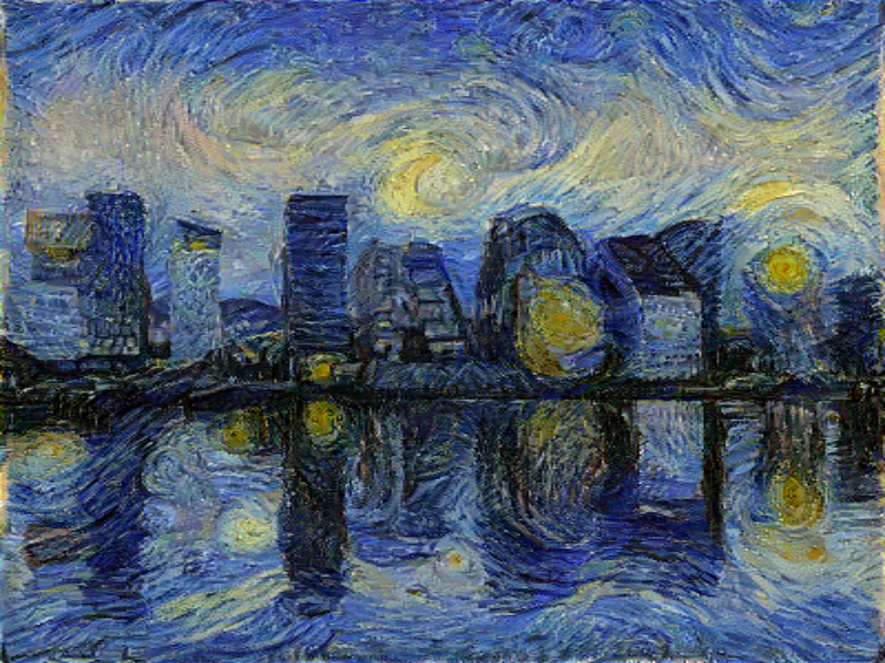</td>
  </tr>
  <tr>
   <td></td>
   <td>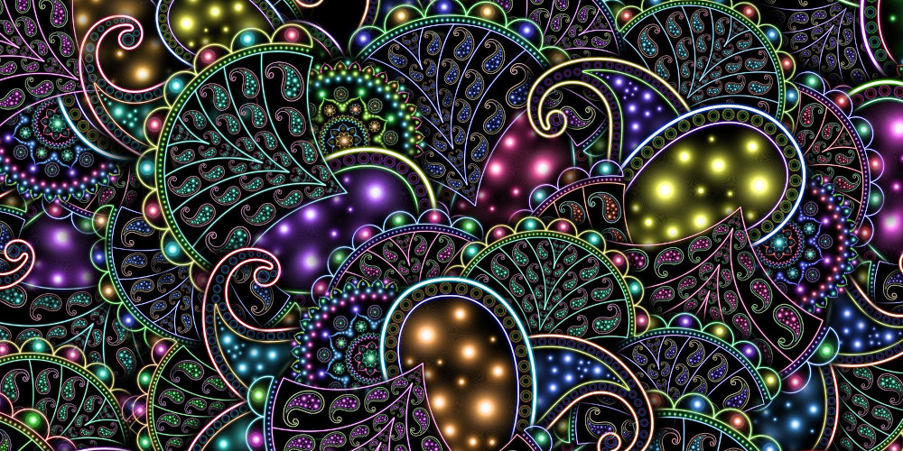</td>
   <td>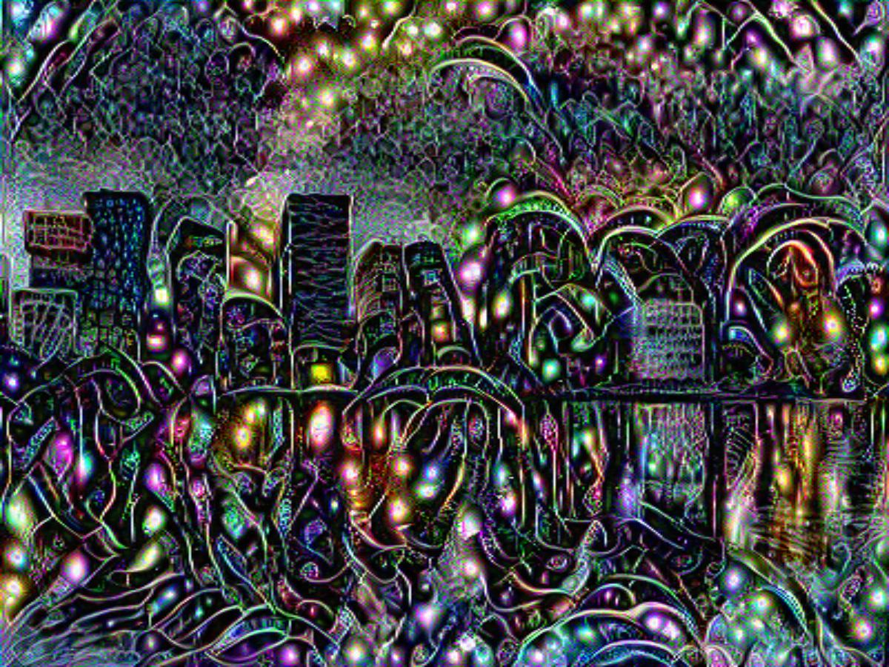</td>
  </tr>
  <tr>
   <td>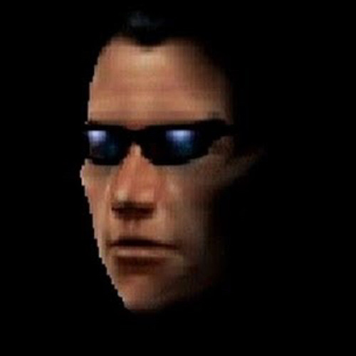</td>
   <td></td>
   <td>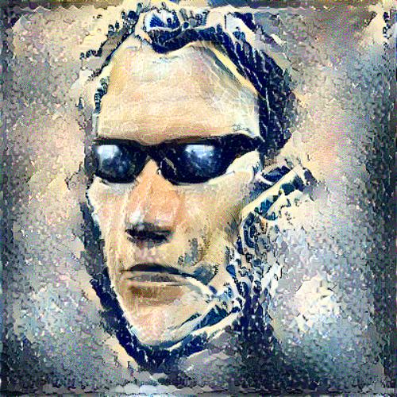</td>
  </tr>
 </table> 

## Perceptual Losses for Real-Time Style Transfer and Super-Resolution

Faster version of NST by [Johnson et al. \[2016\]](https://arxiv.org/abs/1603.08155).

 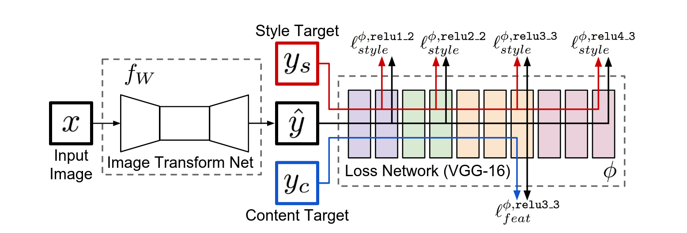
 
Fast NST training architecture. Input image and content image are the same for NST.

Works by training an image transformation network that takes a content image as input and outputs the same image in the chosen style.
The transformation network is trained by using the same set of loss functions as the original version. The pretrained VGG16 network is chosen for generating the features.
The optimization is now done with Adam with the parameters of the transformation network as the target instead of the generated image directly.

The unlabeled MSCOCO dataset is used for training the network. The images in the dataset are used as content images, while the style image is chosen per model.
This means that a separate transformation network must be trained for each style image,
but with the advantage that the transformation network can be applied to any image instantly instead of solving an optimization problem each time.

Also includes the small improvement of replacing the batch normalization layers with instance normalization as proposed by [Ulyanov et al. \[2016\]](https://arxiv.org/abs/1607.08022).

### Examples

 <table>
  <tr>
   <th>Content</th>
   <th>Style</th>
   <th>Output</th>
  </tr>
  <tr>
   <td></td>
   <td></td>
   <td>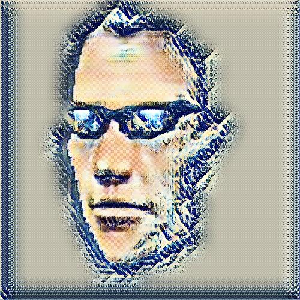</td>
  </tr>
  <tr>
   <td></td>
   <td></td>
   <td>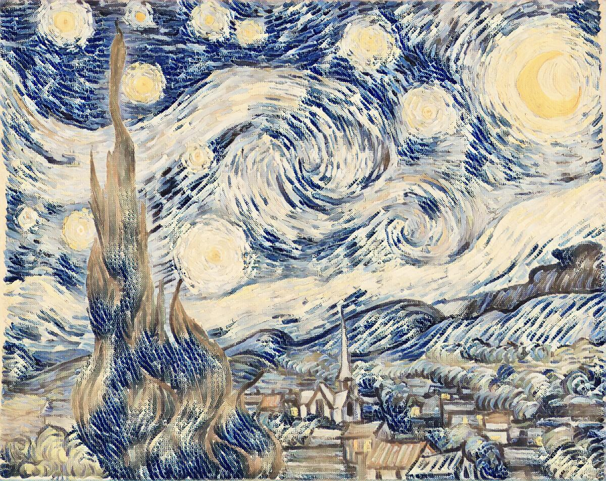</td>
  </tr>
  <tr>
   <td></td>
   <td></td>
   <td>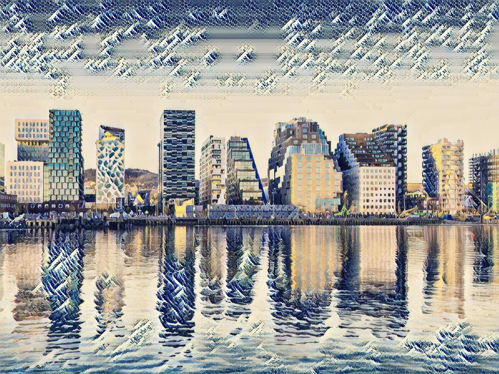</td>
  </tr>
 </table> 

## Arbitrary Style Transfer in Real-time with Adaptive Instance Normalization

Arbitrary version by [Huang et al. \[2017\]](https://arxiv.org/abs/1703.06868).
Generalizes the Fast NST model to work with any style and content images.

 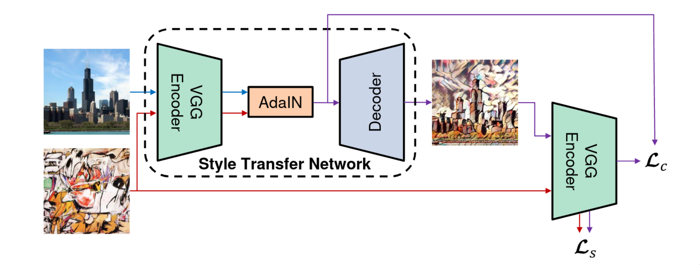
 
Arbitrary NST training architecture.

Creates a model based on the pretrained VGG19 model as a feature encoder, followed by the Adaptive Instance Normalization (AdaIN) layer and a custom decoder network.
The AdaIN layer transforms the mean and variance of the content image features to be the same as the features from the style image.
These transformed features are then sent into the decoder to get the stylized content image.
The decoder is trained by minimizing the difference between the VGG19 features of the transformed image and the content image (content loss),
and VGG19 features from multiple different layers of the tranformed image and the style image (style loss).

The model is then able to be applied to any content image and style image, unlike the fast NST which trains a separate model for each style image.

The model is trained on the unlabeled MSCOCO dataset for content images and the WikiArt dataset for style images.

## Arbitrary Style Transfer with Style-Attentional Networks

[Park et al. \[2018\]](https://arxiv.org/abs/1812.02342)

TODO

## AdaAttN: Revisit Attention Mechanism in Arbitrary Neural Style Transfer

[Liu et al. \[2021\]](https://arxiv.org/abs/2108.03647)

TODO
