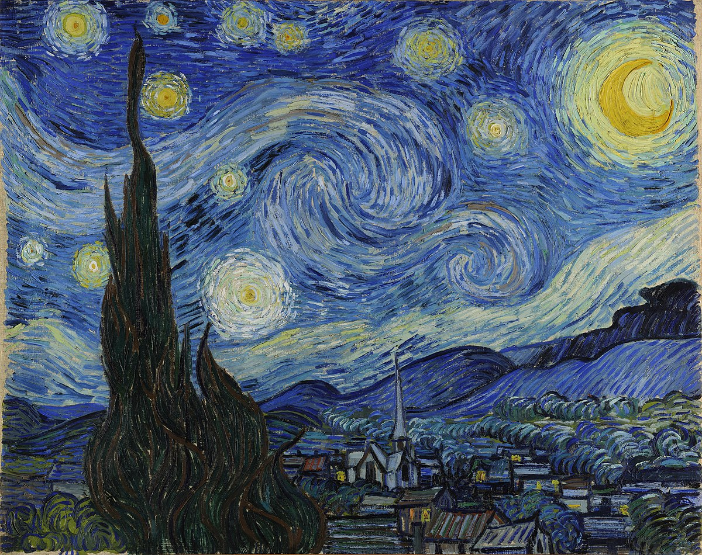

# Neural Style Transfer

Implementations of various neural style transfer algorithms. Generate a new image by transfering the content of one image and the style of another.

## A Neural Algorithm of Artistic Style

Original paper by [Gatys et al. \[2015\]](https://arxiv.org/abs/1508.06576).

Works by using a pretrained image classification model and comparing output features between the generated image and the content image.
The style features are generated by computing the Gram matrix of the output features from the style image.
The Gram matrix gives an indication of what features are correlated to eachother to make a style.
Compute a loss function from the L2 differences of the content and style features and solve the optimization problem by treating the generated image as the optimization variable.

The algorithm is implemented in PyTorch using a VGG19 model pretrained on the 1000 class ImageNet. The optimization is implemented with PyTorch autograd and the L-BFGS numerical algorithm.

Also includes a total variation loss component to minimize high-frequency noise in the generated image.

### Examples

 <table>
  <tr>
   <th>Content</th>
   <th>Style</th>
   <th>Output</th>
  </tr>
  <tr>
   <td></td>
   <td></td>
   <td></td>
  </tr>
  <tr>
   <td></td>
   <td></td>
   <td></td>
  </tr>
 </table> 

## Perceptual Losses for Real-Time Style Transfer and Super-Resolution

Faster version of NST by [Johnson et al. \[2016\]](https://arxiv.org/abs/1603.08155).

## Arbitrary Style Transfer in Real-time with Adaptive Instance Normalization

[Huang et al. \[2017\]](https://arxiv.org/abs/1703.06868)
